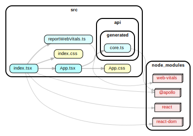

# JALP - Just Another Learning Platform
This is just another learning platform (JALP) to enable a user to learn and practice new things of interest. 

## Getting started
TODO

## Domain
The domain is based on a set of highlevel core concepts like flashcards, cheat sheets, roadmaps, and so on (see chapter regarding [core domains](#Core-Domain)). These core domain concepts are applied in concrete functional domains like learning languages, practicing music and sports (see chapter regarding [sub domains](#Sub-Domains)).

### Core Domain
The platform uses different established learning practices to help a user keep motivated and to structurally learn these new things, i.e. using:
- Flashcards  
  Flashcards are learning aids for memorizing. Combined with learning systems like the [Leitner-System](https://en.wikipedia.org/wiki/Leitner_system) they are efficient tools. I have a love-hate relationship to flashcards, I never liked using them but undoubtly they are quite effective (for me) for learning stuff based on memorizing. 
- Cheat-sheets  
  A cheat sheet in its essence a comprimised summary of a topic in the most compressed form. Writing cheat sheets (without applying:-) ) helped me to focus a lot at school and university. This platform should support the process of creating mantaining cheat sheets. 
- Road Maps  
  Road Maps are a great tool to structure a complex net of interelated topics in a larger context. Especially developer roadmaps (i.e. https://roadmap.sh/) helped me a lot giving some guideline when starting in the industry and find my way of becoming a developer. They are both a good tool to understand an ecosystem and measure progress. 
- Practice Schedules  
  Learning only creates knowledge but practice creates skill. A practice schedule helps to apply the knowledge on a daily bases. Often I started something interesting, got lost in the process and stopped practicing it.

### Sub Domains

### Sub Domain 1: Learning Korean
The platform offers it to create and use vocabulary flashcards in Korean. Also it helps measuring progress. Also grammar flashcards are supported and dynamic tests are possible.

### Sub Domain 2: Practice Guitar
There is an option to have flashcards as guitar lessons for specific topics (like Blues Scale, Chord Shapes, Muting Techniques, ...). There is also a dictionary of song transcriptions as flashcards. It is possible to organise and measure weekly practice.

### Sub Domain 3: Improve Software Developer Skills
This sub domain deals with learning and measuring progress in aquiring developer skills. A developer roadmap supports this process.

### Sub Domain 4: Doing sports and fitness
A fitness schedule and sports practice is enabled by the learning platform.

## Implementation
Basic idea is a typescript based server-/client-application based on hexagonal architecture and a scalable GraphQL domain model.

### GraphQL Domain
#### Code generation
TODO

### Server
The server is a monolothic nodejs application.

#### Dependency Diagram Server

#### Architecture Linting
TODO

### Client
The client is a react application.

#### Dependency Diagram Client

### Build
TODO