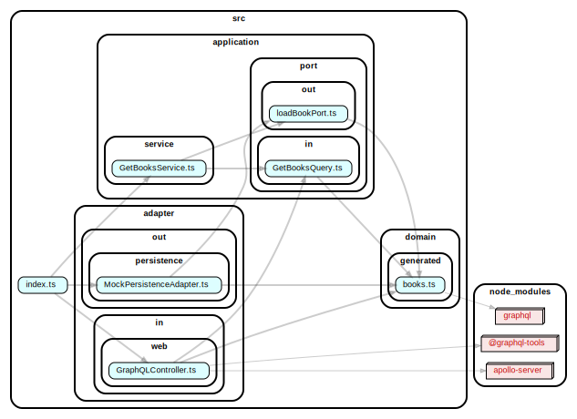

# jalp
Just another learning platform

Basic idea is a typescript based server-/client-application based on hexagonal architecture.

Techstack Backend
- Node.js
- Graphql
- MongoDB

Techstack Frontend
- React
- Graphql

## Dependency Diagram
